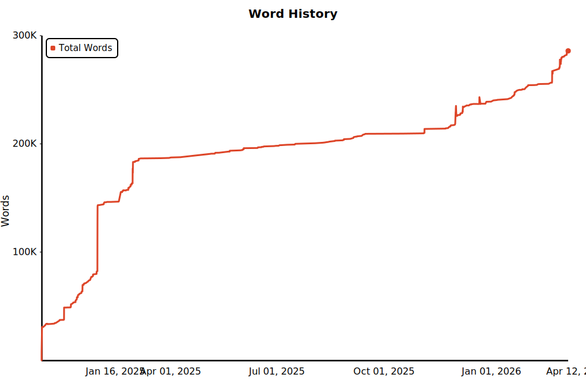

# Obsidian Word History Tool

一个本地优先的小工具：
它会直接读取你的 **Obsidian 仓库的 Git 历史**，按你当前 `novel-word-count` 的统计口径重建字数变化，并生成：

- `analysis.json`：结构化分析结果
- `chart.svg`：主图矢量产物，风格尽量贴近 Star History
- `report.html`：本地离线报告页

当前默认面向你的 vault：`/Users/hong/Obsidian Notes`

---

## Word History



---


## 这个程序现在能做什么

### 1. 重建总字数趋势
- 从 Git commit 历史回放整个 vault
- 按每个 commit 时点重建仓库总字数
- 生成一张 **Star History 风格** 的趋势图
- 图表主产物为 `chart.svg`

### 2. 统计最近 30 天更新最频繁的内容
- 不再显示“历史累计增长最多”的 Top N
- 改为统计：**最近 30 天内，被 commit 触达次数最多的笔记**
- 这是按 Git 历史里的“修改/新增/删除/rename 触达”来算的

### 3. 尽量对齐 `novel-word-count` 口径
当前实现会尽量模拟你本地 `novel-word-count` 插件的字数统计规则：

- 先去掉 YAML frontmatter
- 英文按空白分词统计
- 中文 / 日文 / 韩文按 CJK 字符计数
- 总字数公式：
  - `wordCount = spaceDelimitedWordCount + cjkWordCount`

并且默认会读取你本地插件配置：
- `excludeComments`
- `excludeCodeBlocks`
- `excludeNonVisibleLinkPortions`
- `excludeFootnotes`

如果你不手动传命令行参数，它会优先使用 vault 里 `novel-word-count` 当前配置。

### 4. 保留离线使用能力
- 不依赖在线服务
- 不依赖 GitHub API
- 只要本地 `.git` 历史还在，就能重建
- 输出的 `report.html` / `chart.svg` 都可以离线打开

---

## 当前不会做什么

为了保证第一版足够稳定、简单，当前**不做**这些事情：

- 不做在线服务
- 不做账号同步
- 不做 Obsidian 插件形态
- 不做 daily net additions 图
- 不做按文件夹统计首页
- 不做 rename lineage 合并

特别说明：

### rename 仍然按 path 处理
当前版本里，笔记身份是 **仓库相对路径**。
所以如果一个文件发生 rename：
- 旧路径会被当成旧内容
- 新路径会被当成新内容

也就是说，rename 历史目前**不会自动合并成同一篇笔记**。

---

## 输出文件说明

执行一次构建后，会在输出目录下生成：

### `analysis.json`
机器可读的分析结果，包含：
- `schema_version`
- `generated_at`
- `vault_path`
- `head_commit`
- `renderer_version`
- `summary`
- `commit_trend`
- `recent_active_notes_30d`

### `chart.svg`
主图矢量产物。
适合：
- 直接打开看
- 插到别的页面里
- 后续继续二次处理

### `report.html`
一个本地离线报告页，包含：
- 总字数趋势图（引用 `chart.svg`）
- 最近 30 天更新最频繁内容列表
- 基本摘要信息

---

## 使用方法

在项目目录里执行：

```bash
cd /Users/hong/Downloads/obsidian-word-history-tool
PYTHONPATH=. python3 -m obsidian_word_history build \
  --vault "/Users/hong/Obsidian Notes"
```

默认会把结果输出到项目目录下的 `out/`：

- `out/analysis.json`
- `out/chart.svg`
- `out/report.html`

执行完成后，可以直接打开：

```bash
open /Users/hong/Downloads/obsidian-word-history-tool/out/report.html
```

或者直接看主图：

```bash
open /Users/hong/Downloads/obsidian-word-history-tool/out/chart.svg
```

---

## 可配置项

当前配置故意保持很少，只保留实用项。

### `--top-n`
控制“最近 30 天高频更新内容”列表显示多少条。

例如：

```bash
PYTHONPATH=. python3 -m obsidian_word_history build \
  --vault "/Users/hong/Obsidian Notes" \
  --top-n 20
```

### `--out`
如果你不想用默认的 `./out`，也可以手动指定输出目录。

例如：

```bash
PYTHONPATH=. python3 -m obsidian_word_history build \
  --vault "/Users/hong/Obsidian Notes" \
  --out "/Users/hong/Downloads/somewhere-else"
```

### 统计排除开关
如果你想临时覆盖本地 `novel-word-count` 配置，可以显式传这些参数：

- `--exclude-comments`
- `--exclude-code-blocks`
- `--exclude-non-visible-link-portions`
- `--exclude-footnotes`

例如：

```bash
PYTHONPATH=. python3 -m obsidian_word_history build \
  --vault "/Users/hong/Obsidian Notes" \
  --exclude-code-blocks \
  --exclude-comments
```

### `--generated-at`
用于测试或固定输出时间戳。

---

## 当前统计口径说明

### “总字数趋势”是什么意思？
表示：
- 每个 commit 时点
- 整个 vault 中所有 Git 跟踪文件的总字数

### “最近 30 天更新最频繁的内容”是什么意思？
表示：
- 以 **最后一个 commit 的时间** 作为统计终点
- 回看最近 30 天
- 哪些笔记被 commit 触达得最多

这里的“触达”包括：
- 新增
- 修改
- 删除
- rename（旧路径和新路径分别记）

### 为什么列表数量和 `novel-word-count` 里看到的文件数可能不同？
因为这个工具只统计 **Git 跟踪到的文件**；
而插件缓存里可能还保留了：
- 当前未纳入 Git 的文件
- 插件自己的缓存状态
- 某些仓库外/历史缓存项

但在你的当前 vault 上，**总字数已经与插件当前缓存对齐**。

---

## 项目结构

```text
obsidian_word_history/
  __init__.py
  __main__.py
  analysis.py      # Git 历史回放与数据分析
  cli.py           # 命令行入口
  counting.py      # 字数统计口径
  render.py        # chart.svg / report.html 渲染
  font_data.py     # Star History 使用的嵌入字体资源

tests/
  test_analysis.py
  test_cli_integration.py
  test_markdown_counter.py
```

---

## 后续可能继续做的事情

如果后面继续迭代，比较自然的方向是：

- 加入按文件夹统计
- 做 rename 合并策略
- 加缓存优化，缩短真实仓库的构建耗时
- 做成和 Star History 类似的自动更新流程：每次 push 后自动重建 `chart.svg` 并更新 README
- 修正当前时间轴与真实提交时间的对应误差

详细路线图见：`docs/automation-roadmap.md`
