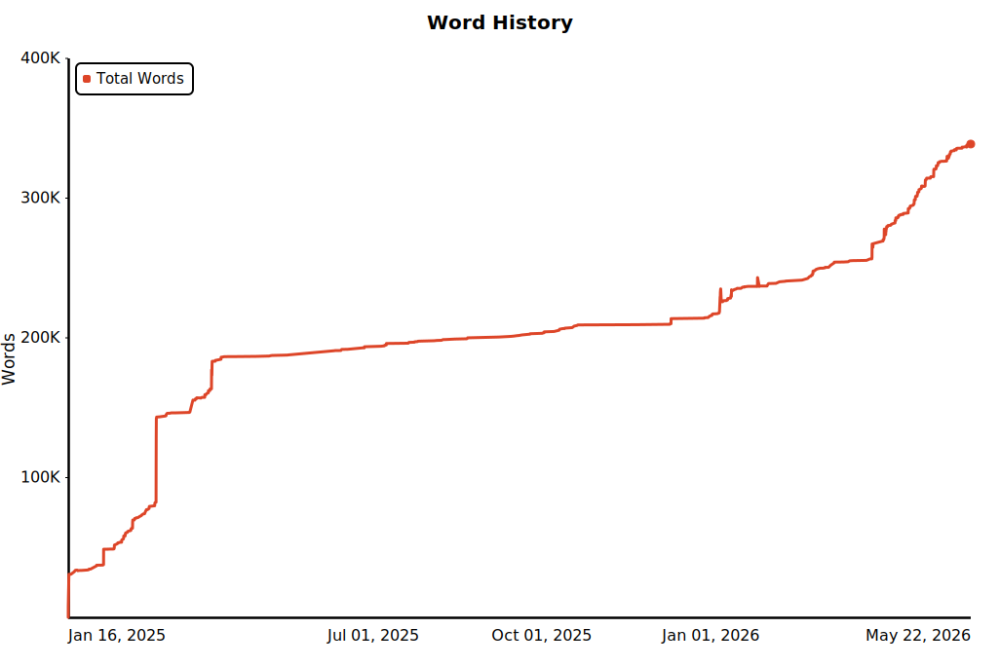

# Obsidian Word History Tool

[English README](README.en.md)

这是一个轻量本地工具：从 Git 管理的 Obsidian vault 中回放 Markdown 历史，并生成一张词数变化 SVG 图表。

## 示例图



## 快速开始

先配置本地环境和输出路径：

```bash
./scripts/setup_env.sh "$HOME/Documents/ObsidianVault" "$HOME/Documents/ObsidianVault/Reference/chart.svg"
```

之后刷新图表只需要运行：

```bash
./scripts/generate_chart.sh
```

生成脚本会显示进度，并在完成后输出一行 JSON：

```json
{"chart_svg": "/path/to/your/vault/Reference/chart.svg"}
```

## 不写本地配置，直接指定路径

```bash
./scripts/generate_chart.sh "<vault_path>" "<chart_svg_path>"
```

## 直接使用 Python CLI

```bash
PYTHONPATH=. python3 -m obsidian_word_history build \
  --vault "<vault_path>" \
  --out out
```

输出文件：

- `out/analysis.json`
- `out/chart.svg`

## 本地配置

`./scripts/setup_env.sh` 会创建 `.venv`，并生成 `.env.local`：

```bash
OBSIDIAN_WORD_HISTORY_VAULT="/path/to/your/vault"
OBSIDIAN_WORD_HISTORY_CHART="/path/to/your/vault/Reference/chart.svg"
```

`.env.local` 已被 Git 忽略，适合保存你自己的 vault 路径和输出路径。

## 保留的能力

- 回放 Obsidian vault 的 Git 历史
- Markdown 与 CJK 友好的词数统计
- 纯 Python SVG 渲染
- 一个日常使用的一键生成脚本
- 覆盖统计、分析、渲染和脚本行为的回归测试

## 注意事项

- vault 必须是 Git 仓库。
- 重命名处理仍然基于路径；不同路径之间不会合并历史 lineage。
- 运行依赖是 Python 标准库和本地 `git` 命令。
- light 版本不需要 dashboard、Node、pnpm 或 vendored renderer。
